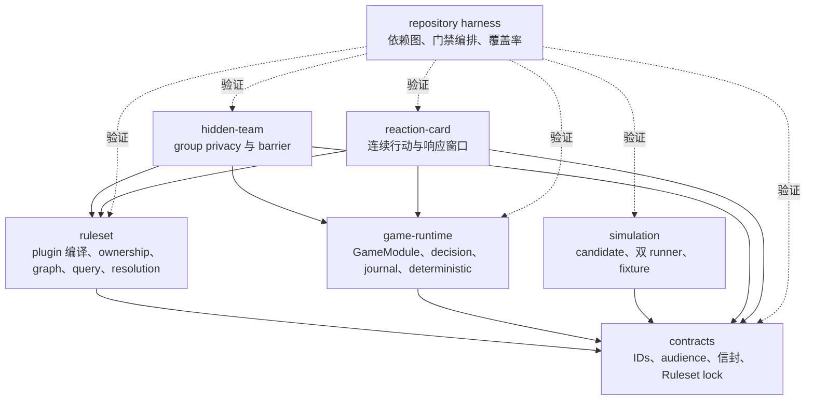
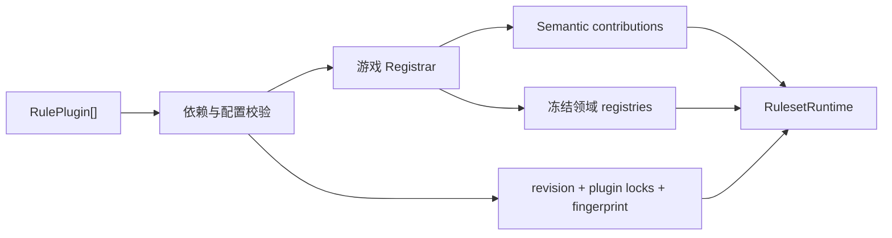
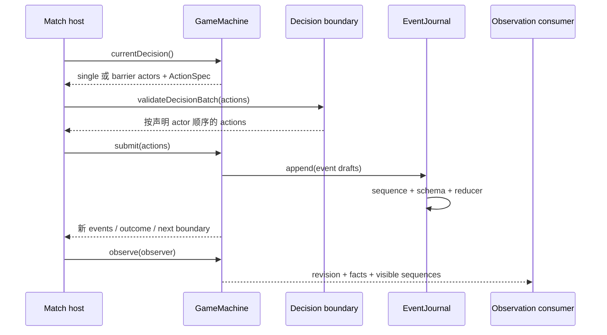

# Agent Arena Core 架构设计

本文描述 Agent Arena Core 当前提供的 Ruleset 编译、确定性游戏运行契约、conformance games 与仓库
门禁。目标读者可以据此新增通用规则能力、实现一个游戏模块，或判断某项语义应由 Ruleset Core、
game runtime 还是游戏模块拥有。精确字段和失败行为由各 package README、schemas 与测试负责。

## 设计目标与约束

当前结构同时满足以下约束：

- Ruleset plugin 的依赖、配置、安装顺序、语义所有权和发布指纹可机械验证；
- 游戏状态只通过按序事件归约，create 与 restore 使用同一 reducer；
- Match host 通过统一 decision boundary 驱动单人行动或多人 barrier；
- audience 在事件产生时声明，observation 从授权后的事件与状态构造；
- 规则组合算法不要求共享具体游戏的 state、action payload、event payload 或 outcome；
- 通用抽象由两种控制流不同的 conformance games 共同验证。

## 组件与依赖方向

生产 packages 共享一层 contracts，Ruleset 与 game runtime 彼此独立。examples 在组合层同时消费两者。

| 组件                 | 拥有的职责                                                               | 主要产出                             |
| -------------------- | ------------------------------------------------------------------------ | ------------------------------------ |
| `contracts`          | branded IDs、Ruleset lock、observer/audience、action/event/decision 信封 | Zod schemas 与跨包类型               |
| `ruleset`            | plugin 拓扑安装、配置解析、semantic ownership、锁定、组合图、query、结算 | `RulesetRuntime` 与领域 registrar    |
| `game-runtime`       | decision action/batch 校验、事件 journal、GameModule 接口、确定性随机    | 可由 Match host 驱动的 `GameMachine` |
| `simulation`         | candidate 读取、runner 复跑、差异与敏感内容检查、fixture 批准            | reviewed deterministic corpus        |
| conformance examples | 用独立领域状态组合 Ruleset 与 GameModule                                 | 可执行测试游戏及其 restore 证据      |
| repository harness   | 运行门禁阶段并校验内部依赖、文件边界、类型、格式、覆盖率和构建           | 独立仓库验收结果                     |

## Ruleset 编译与锁定

`RulePlugin<Registrar>` 声明 plugin ID、版本、配置 schema、依赖和注册函数。安装器验证重复 ID、依赖
版本与依赖环，按稳定拓扑顺序调用 registrar。`RulesetRegistrar` 将安装作用域交给 semantic ownership
recorder，领域 registrar 在注册 action、event、phase、query、card 或其他语义时记录对应 kind 与 ID。

Ruleset fingerprint 使用稳定 key 顺序计算，包含 Ruleset ID、revision、有序 plugin ID/version、规范化
配置与配置哈希。调用方使用 `assertRulesetLock` 对比 release 与持久 lock；release 或 fingerprint
不一致时停止执行。

`PhaseGraphRegistry` 保持 node 类型开放，只要求 ID 与有向 edges。它验证重复 node、插入位置、边
目标、插入依赖环和最终可达性。`QueryRegistry` 由游戏提供 query type 与 context，按 order 和注册
顺序应用 modifiers。`ResolutionRegistry` 由游戏提供 effect union、lanes、context、contribution 合并
函数和步数上限；schema 解析、同 lane 排序、动态入队、环检测与 finalizer 顺序由 Core 执行。

## Decision 与事件运行流

`GameModule` 定义 setup/outcome schemas、create、restore、observe 与 group membership。它创建的
`GameMachine` 暴露当前 state、events、outcome 和 decision boundary，并负责领域 action validation
与事件产生。

`single` boundary 恰好包含一个 actor 和一个已提交动作。同一 actor 可以在事件变化后继续获得新的
single boundary。`barrier` boundary 冻结完整 actor 集，每个 actor 恰好提交一个动作；Core 按 boundary
中的 actor 顺序返回 batch，使并发完成顺序不改变规则提交顺序。

每个 `ActionSpec` 声明 action type、工具名、结构化/文本输入方式、payload Zod schema 和可选 stream
audience。通用校验先确认 decision、actor 与 action type，再解析 payload；游戏校验继续处理资源、
目标、关系或阶段合法性。

`EventJournal` 分配 Match 内单调 sequence 和时间，追加后立即调用 reducer。restore 要求 Match ID
一致且 sequence 从一开始连续。`replay()` 从 initial state 归约同一事件集合，用于检查当前 state 与
事件事实一致。

## 可见性与 conformance

audience 支持 public、host、participant set 与 group。host 可以读取全部事件；spectator 只读取
public；participant 同时读取 public、显式 participant 和其所属 group 事件。游戏模块从过滤后的事件
与领域状态构造 observation facts。

`hidden-team` 使用两支队伍的私有关键词、同步公开提示和同步猜测，验证 group visibility、文本
ActionSpec、barrier 完整性、稳定 actor 顺序、轮换 actor 与终局 restore。

`reaction-card` 使用确定性牌堆、participant-only 抽牌事件、连续主行动和嵌套响应 boundary，验证
私有资源、seed 稳定性、响应窗口 restore、阻挡与伤害结算以及终局 replay。

## 仿真评审

simulation candidate 保存游戏 ID、Ruleset lock、setup、结构化 Turns、runtime controls、完整 observed
events、checkpoint、来源 fingerprint 与 warnings。candidate 路径使用 exclusive create；相同 ID 的
不同来源内容以冲突失败。

workflow 至少要求两个独立 `SimulationRunner`。评审以同一个 variant 将 candidate 交给每个 runner
执行两次，分别比较 runner 自身确定性，再比较所有 runner 的 canonical result。secret scan、runner
determinism 和 runner agreement 同时成立时，runner result 具备显式接受资格；runner 同时报告成功
时，captured observation 可以直接批准。

批准将完整 events 收敛为 event count、event digest、event type sequence 与游戏 checkpoint，并使用
exclusive create 写入 fixture。warnings 需要显式 acknowledgement；runner result 与 capture 不同
时需要显式 `acceptCurrent`。既有 fixture 只接受相同 source fingerprint 与 reviewed result。

## 仓库门禁

`run-gates` 按阶段并行执行 repository policies 与代码检查，在任一阶段失败时停止后续阶段。当前
门禁覆盖：

- packages 与 examples 的允许依赖图及 workspace manifest 一致性；
- source file 行数上限；
- TypeScript build 与测试类型；
- type-aware lint、格式和未使用依赖；
- 产品源码逐文件 statements、branches、functions 与 lines 覆盖率；
- 全 workspace 生产构建。

文件发现会在嵌套 Git repository 或 submodule 标记处停止，使每个仓库独立拥有自己的文档、指令和
代码门禁。

## 架构不变量

- 游戏 registrar 拥有具体 semantic kinds 与 registries，Ruleset Core 拥有组合和锁定算法。
- `ruleset`、`game-runtime` 与 `simulation` 只依赖 `contracts`；examples 是组合层。
- decision boundary 是 host 驱动游戏的唯一行动契约。
- barrier action batch 按冻结 actor 顺序提交。
- game state 由 initial state 与连续事件唯一重建。
- observation 只包含其 observer audience 授权的事实。
- simulation fixture 只来自确定性复跑、runner agreement 与显式批准。
- conformance examples 通过公开 package exports 组合运行时。
