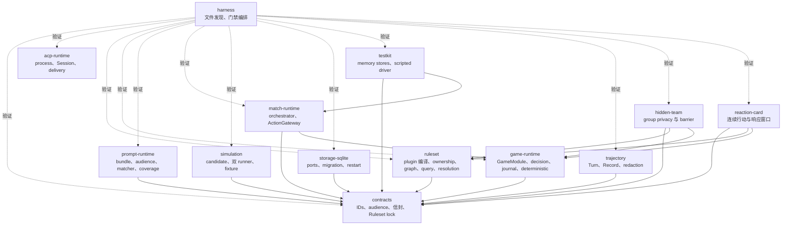
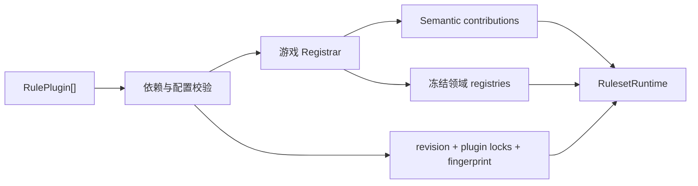
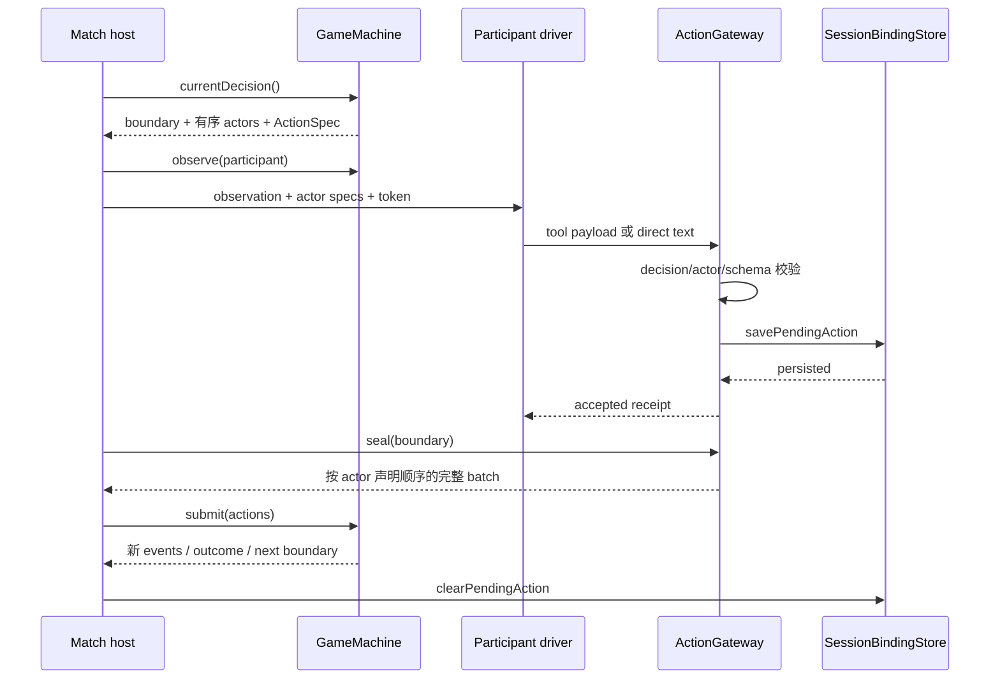

# Agent Arena Core 架构设计

本文描述 Agent Arena Core 当前提供的 Ruleset 编译、确定性游戏运行契约、Prompt bundle、Match 编排、
持久化端口与仓库验证能力。目标读者可以据此实现游戏模块、连接 participant runtime，或判断某项
语义应由平台还是游戏拥有。精确字段和失败行为由各 package README、schemas 与测试负责。

## 设计目标与约束

当前结构同时满足以下约束：

- Ruleset plugin 的依赖、配置、安装顺序、语义所有权和发布指纹可机械验证；
- 游戏状态只通过按序事件归约，create 与 restore 使用同一 reducer；
- Match host 通过统一 decision boundary 驱动单人行动或多人 barrier；
- Action gateway 从当前 `ActionSpec` 动态建立输入契约，accepted action 在成功回执前进入 store；
- audience 在事件产生时声明，observation 从授权后的事件与状态构造；
- Prompt bundle 的静态依赖、敏感度与 semantic ownership 在渲染前完成校验；
- 一个逻辑 ACP Session 可以由新进程按精确 Session ID 恢复；
- Prompt delivery 在 acknowledgement 前保持显式 in-flight 或 uncertain 状态；
- ACP Turn 的 Prompt、stream、tool、permission、usage 与 diagnostics 在持久化前统一脱敏和截断；
- 规则组合算法不要求共享具体游戏的 state、action payload、event payload 或 outcome；
- Match、Session binding、delivery 与 trajectory 通过 ports 持久，SQLite 是参考 adapter；
- 两种控制流不同的 conformance games 验证 Ruleset、GameModule、decision、visibility 与 restore；
  其他 packages 由各自的协议、故障和持久化 self-tests 验证。

## 组件与依赖方向

生产 packages 共享一层 contracts。Ruleset、game runtime、Prompt runtime、simulation、trajectory 与
SQLite adapter 彼此独立；Match runtime 只组合 contracts 与 game runtime。examples 在游戏组合层消费
Ruleset 与 game runtime。

| 组件                 | 拥有的职责                                                               | 主要产出                             |
| -------------------- | ------------------------------------------------------------------------ | ------------------------------------ |
| `acp-runtime`        | stdio 进程、协议协商、Session new/resume、permission、Prompt 与 delivery | 可恢复的 `AcpSession` 和送达台账     |
| `contracts`          | branded IDs、Ruleset lock、observer/audience、action/event/decision 信封 | Zod schemas 与跨包类型               |
| `ruleset`            | plugin 拓扑安装、配置解析、semantic ownership、锁定、组合图、query、结算 | `RulesetRuntime` 与领域 registrar    |
| `game-runtime`       | decision action/batch 校验、事件 journal、GameModule 接口、确定性随机    | 可由 Match host 驱动的 `GameMachine` |
| `prompt-runtime`     | bundle 安全装载、静态 import、audience、matcher 与 semantic coverage     | 预编译的游戏 Prompt 模板图           |
| `match-runtime`      | participant observation、动态输入、pending action 与密封 barrier         | 稳定排序后提交的 action batch        |
| `simulation`         | candidate 读取、runner 复跑、差异与敏感内容检查、fixture 批准            | reviewed deterministic corpus        |
| `storage-sqlite`     | store ports 的 module-scoped migration、事务写入、解析与级联删除         | 可重启的参考 SQLite stores           |
| `trajectory`         | ACP Turn 内 stream 合并、tool upsert、permission、usage、脱敏与截断      | 可持久化的 Turn/Record callbacks     |
| `testkit`            | 内存 stores、scripted participant、延迟与故障注入                        | 无产品数据的 runtime 测试驱动        |
| conformance examples | 用独立领域状态组合 Ruleset 与 GameModule                                 | 可执行测试游戏及其 restore 证据      |
| `harness`            | repository 文件发现与 phase gate runner；policy 由仓库脚本提供           | 独立仓库验收结果                     |

## Ruleset 编译与锁定

`RulePlugin<Registrar>` 声明 plugin ID、版本、配置 schema、依赖和注册函数。安装器验证重复 ID、依赖
版本与依赖环，按稳定拓扑顺序调用 registrar。`RulesetRegistrar` 将安装作用域交给 semantic ownership
recorder，领域 registrar 在注册 action、event、phase、query、card 或其他语义时记录对应 kind 与 ID。

Ruleset fingerprint 使用稳定 key 顺序计算，包含 Ruleset ID、revision、有序 plugin ID/version、规范化
配置与配置哈希。调用方使用 `assertRulesetLock` 对比 release 与持久 lock；release 或 fingerprint
不一致时停止执行。

`PhaseGraphRegistry` 保持 node 类型开放，只要求 ID 与有向 edges。它验证重复 node、插入位置、边
目标、插入依赖环和最终可达性。`QueryRegistry` 由游戏提供 query type 与 context，按 order 和注册
顺序应用 modifiers。`ResolutionRegistry` 由游戏提供 effect union、lanes、context、contribution 合并
函数和步数上限；schema 解析、同 lane 排序、动态入队、环检测与 finalizer 顺序由 Core 执行。

## Decision 与事件运行流

`GameModule` 定义 setup/outcome schemas、create、restore、observe 与 group membership。它创建的
`GameMachine` 暴露当前 state、events、outcome 和 decision boundary，并负责领域 action validation
与事件产生。

`single` boundary 恰好包含一个 actor 和一个已提交动作。同一 actor 可以在事件变化后继续获得新的
single boundary。`barrier` boundary 冻结完整 actor 集，每个 actor 恰好提交一个动作；Core 按 boundary
中的 actor 顺序返回 batch，使并发完成顺序不改变规则提交顺序。

每个 `ActionSpec` 声明 action type、工具名、结构化/文本输入方式、payload Zod schema 和可选 stream
audience。文本输入可以通过 `textInput` 转换为领域 payload。通用校验先确认 decision、actor 与 action
type，再解析 payload；游戏校验继续处理资源、目标、关系或阶段合法性。

`EventJournal` 分配 Match 内单调 sequence 和时间，追加后立即调用 reducer。restore 要求 Match ID
一致且 sequence 从一开始连续。`replay()` 从 initial state 归约同一事件集合，用于检查当前 state 与
事件事实一致。

## Match 编排与恢复边界

`MatchOrchestrator` 为 boundary 中每个 actor 生成 participant observation，并要求 observation revision
与 boundary 完全一致。participant driver 可以连接 ACP、人工输入或确定性脚本；它只通过 gateway
提交当前 actor 的正式工具或 direct text。gateway 不认识游戏阶段，也不维护第二份规则状态。

`single` 在一个 action 落定后提交；同一 participant 可以在新 boundary 中继续行动。`barrier` 并发
驱动全部 actors，但 gateway 在动作集完整前不向 `GameMachine` 提交任何内容。seal 按 boundary actor
顺序返回 batch，因此 participant 完成顺序不会改变事件顺序或向其他 actor 暴露部分选择。

Session binding store 中与当前 decision ID 匹配的 pending action 会在 driver 启动前恢复并重新校验。
新 action 的持久化 callback 在 gateway 返回 accepted receipt 前完成。编排失败会关闭内存 expectation，
保留已持久 action，且不会提交不完整 barrier；成功提交后才清理所有参与者的 pending action。产品层
决定如何把失败转换为暂停、重试或终止。

## Prompt bundle 运行时

Prompt runtime 从游戏提供的 manifest adapter 读取 bundle ID、显式 imports、template references、
shared exports 与静态 audience。loader 拒绝路径逃逸、symlink、非 Nunjucks 文件、缺失模板、动态或
未限定 import 和依赖环，并在 registry 使用前预编译全部模板。

静态敏感度分为 public、participant、group 与 host。public 只能组合 public；participant 和 group
只能组合自身类别或 public；host 可以组合全部内容。声明式 event matcher 使用 event type、属性路径
相等或存在条件，并按 specificity 选择唯一呈现；同 specificity 重叠在安装时失败。semantic coverage
以游戏定义的 kind 集合精确对比 Ruleset contributions 与 bundle claims，Core 不枚举 Role、Card、
Phase 或工具名称。

## 持久化 ports 与 SQLite adapter

`MatchStore` 拥有 setup、Ruleset lock、运行状态、outcome 与连续确定性事件；
`SessionBindingStore` 拥有逻辑 Session、bootstrap 和 pending accepted action；`DeliveryStore` 保存调用方
定义的 delivery snapshot；`TrajectoryStore` 保存调用方 schema 约束的 Turn/Record entries。ports
只规定状态所有权与恢复操作，不要求数据库实现。

参考 SQLite adapter 为每类状态提供独立表、外键级联与事务写入，并在读取时调用游戏或调用方 codec。
事件 append 验证 Match ID 与连续 sequence。迁移版本记录在 `arena_schema_migrations`，不占用宿主应用
的 `PRAGMA user_version`；高于当前实现的 module version 会拒绝打开。该 adapter 可以独立使用，也可以
与拥有自身 schema 的产品数据库并存。

## 可见性与 conformance

audience 支持 public、host、participant set 与 group。host 可以读取全部事件；spectator 只读取
public；participant 同时读取 public、显式 participant 和其所属 group 事件。游戏模块从过滤后的事件
与领域状态构造 observation facts。

`hidden-team` 使用两支队伍的私有关键词、同步公开提示和同步猜测，验证 group visibility、文本
ActionSpec、barrier 完整性、稳定 actor 顺序、轮换 actor 与终局 restore。

`reaction-card` 使用确定性牌堆、participant-only 抽牌事件、连续主行动和嵌套响应 boundary，验证
私有资源、seed 稳定性、响应窗口 restore、阻挡与伤害结算以及终局 replay。

## 仿真评审

simulation candidate 保存游戏 ID、Ruleset lock、setup、结构化 Turns、runtime controls、完整 observed
events、checkpoint、来源 fingerprint 与 warnings。candidate 路径使用 exclusive create；相同 ID 的
不同来源内容以冲突失败。

workflow 至少要求两个独立 `SimulationRunner`。评审以同一个 variant 将 candidate 交给每个 runner
执行两次，分别比较 runner 自身确定性，再比较所有 runner 的 canonical result。secret scan、runner
determinism 和 runner agreement 同时成立时，runner result 具备显式接受资格；runner 同时报告成功
时，captured observation 可以直接批准。

批准将完整 events 收敛为 event count、event digest、event type sequence 与游戏 checkpoint，并使用
exclusive create 写入 fixture。warnings 需要显式 acknowledgement；runner result 与 capture 不同
时需要显式 `acceptCurrent`。既有 fixture 只接受相同 source fingerprint 与 reviewed result。

## ACP Session 与 delivery

`AgentProcess` 使用显式 command/args/env 和 workspace 启动 ACP stdio 进程。POSIX guardian 持有独立
进程组并中继 stdin，在父进程退出、正常关闭或 grace period 超时时终止后代进程；Windows 直接持有
子进程。stderr 只保留有界 tail，并通过 callback 交给调用方。

`AcpSession.start` 建立 NDJSON connection、协商精确协议版本，并按调用参数执行 `session/new` 或
`session/resume`。resume 使用调用方给定的 Session ID。model、reasoning effort 与 mode 只从 Agent
声明的 config options 中选择；无法兑现的配置以 lifecycle error 失败。

permission handler 对普通工具名和显式 MCP server/tool allowlist 做精确匹配。Provider 只提供不透明
MCP approval 时，调用方需要同时开启兼容标记并提供非空 MCP allowlist。每次 permission request 与
decision 可以通过 callbacks 进入上层诊断。

一次 Session 同时最多有一个 active Prompt。message chunks 按协议顺序合并，调用方可以在结构化动作
回执完成后终止剩余生成。timeout 或 cancel 未确认产生 `AcpDeliveryUncertainError`，并携带 connection
是否仍可复用的判断；协议 close、connection close 与进程关闭均有有界路径。

`DeliveryLedger` 保存 acknowledged sequence 与最多一个 active attempt。`begin` 从已确认 cursor 的
下一 sequence 建立范围；完成后 acknowledge，传输不确定时 mark uncertain。调用方只能明确清理未
发送 attempt，或在外部对账后 abandon uncertain 并推进 cursor。

## Trajectory Turn 与 Record

`TrajectoryTurnRecorder` 接收调用方创建的 Turn、record ordinal store、Turn/Record codecs 和保存
callbacks。每次 mutation 都通过 callback 返回已保存对象，上层据此分配 revision、广播 delta 或接入
其他持久实现。

一个 Turn 内的 reasoning 与 message chunks 按 channel、message ID、tool boundary 和 stream
generation 合并。tool call 与 update 按 tool-call ID upsert；terminal status 写入完成时间和 duration。
usage 同时更新 Turn 并产生 usage Record。permission、accepted action、diagnostic、lifecycle、cancel、
failure 与正常完成形成有序 Record 或 Turn 状态。

结构化 input/output 在序列化前递归处理。authorization、credential、password、secret、token、API key
与 private key 字段写为 `[REDACTED]`，`_meta` 被移除，循环对象写为稳定标记，数组和对象属性有界。
Prompt/message/tool 内容和 diagnostics 使用各自长度上限，截断位置写入 `truncatedFields`。

## 仓库门禁

`@agent-arena/harness` 提供会停止在嵌套 repository/submodule 边界的文件发现和分阶段 gate runner。
Core 的 `run-gates` 在同一 phase 并行执行检查，并在任一 gate 失败时停止后续 phase。当前门禁覆盖：

- packages 与 examples 的允许依赖图及 workspace manifest 一致性；
- 生产 packages 不 import 产品仓库，也不包含具体游戏术语或阶段 semantic；
- source file 行数上限；
- Markdown 链接、AGENTS/架构文档行数与当前态纯净性；
- TypeScript build 与测试类型；
- type-aware lint、格式和未使用依赖；
- 产品源码逐文件 statements、branches、functions 与 lines 覆盖率；
- 全 workspace 生产构建。

`@agent-arena/testkit` 提供内存 store 与 scripted participant driver。脚本可以按 participant 排队动作、
改变完成顺序或注入失败，用于验证密封 barrier 和 pending action 恢复，而不依赖真实 Agent、凭据或
产品数据。

## 架构不变量

- 游戏 registrar 拥有具体 semantic kinds 与 registries，Ruleset Core 拥有组合和锁定算法。
- `ruleset`、`game-runtime`、`simulation` 与 `trajectory` 的内部 package 依赖只指向 `contracts`；
  `prompt-runtime` 与 `storage-sqlite` 同样只指向 `contracts`；examples 是游戏组合层。
- `match-runtime` 只组合 `contracts` 与 `game-runtime`，participant transport 与产品生命周期通过 ports
  接入。
- `acp-runtime` 只拥有协议、进程、Session 与 delivery 原语。
- Prompt runtime 只拥有 bundle 安全、静态 audience 和声明式匹配，不拥有游戏事实或文案。
- `trajectory` 只拥有单个 ACP Turn 内的 Record 语义和内容安全边界。
- decision boundary 是 host 驱动游戏的唯一行动契约。
- barrier action batch 按冻结 actor 顺序提交。
- accepted action 在成功回执前持久化，部分 barrier 永不进入 `GameMachine`。
- SQLite migration 使用 module-owned version，不占用宿主应用 schema version。
- game state 由 initial state 与连续事件唯一重建。
- observation 只包含其 observer audience 授权的事实。
- simulation fixture 只来自确定性复跑、runner agreement 与显式批准。
- Session resume 保持调用方给定的逻辑 Session ID，进程关闭保持有界。
- conformance examples 通过公开 package exports 组合运行时。
